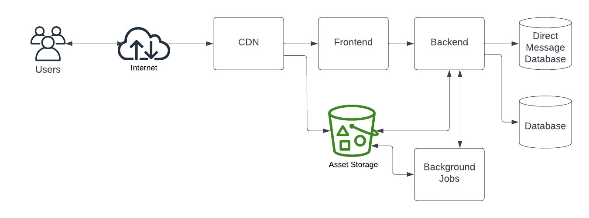
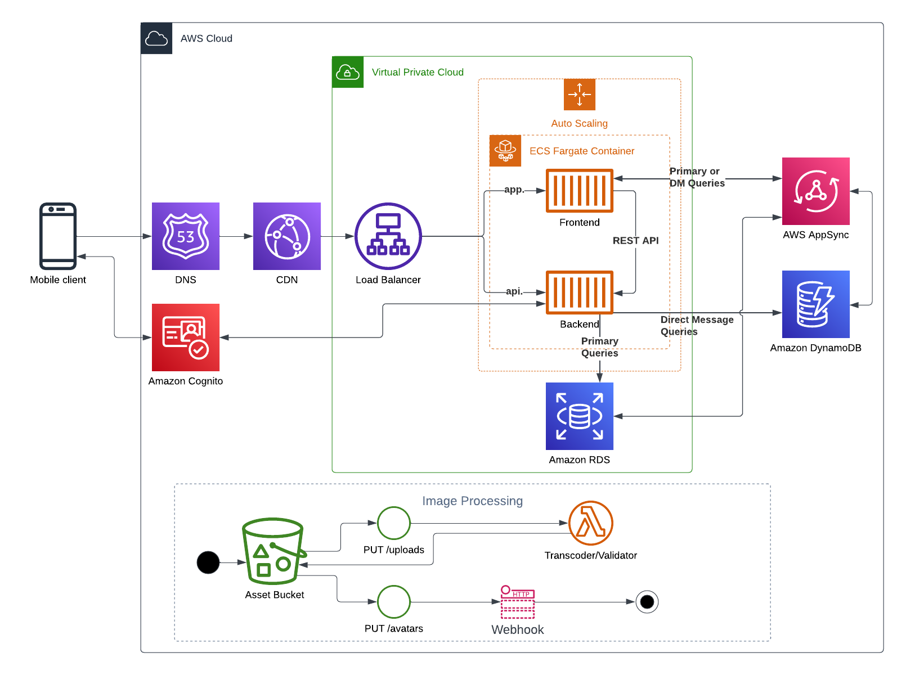

# Week 0 — Billing and Architecture


## Homework

### Recreate Conceptual Diagram in Lucid Charts or on a Napkin

<https://lucid.app/lucidchart/ea45c875-073f-43d1-a7d6-259281e14c5a/edit?viewport_loc=-197%2C-294%2C3755%2C1967%2C7LaKzgSnGNMN&invitationId=inv_d21dfe4a-dd21-4d01-bd4e-c7f2db870acf>



### Recreate Logical Architectural Diagram in Lucid Charts

<https://lucid.app/lucidchart/f2b2119d-dc02-4ddd-a30e-842851763c0e/edit?viewport_loc=-729%2C47%2C3755%2C1967%2C0_0&invitationId=inv_a35de2e1-6e7f-430f-a9b9-cef87dc85f9d>



### Installing the AWS CLI

Set up in the [Gitpod config](https://github.com/lightweavr/aws-bootcamp-cruddur-2023/blob/main/.gitpod.yml), including setting up the AWS CLI autocomplete support and making it work with the Gitpod prebuilds.

Notes:

* followed the [AWS CLI docs that specify the install location](https://docs.aws.amazon.com/cli/latest/userguide/getting-started-install.html#getting-started-install-instructions) to install the CLI under `/workspace` so it persists
* followed the [AWS CLI docs to setup tab completion within Bash](https://docs.aws.amazon.com/cli/latest/userguide/cli-configure-completion.html#cli-command-completion-linux)
* bonus: `PATH` manipulation + `clear`-ing the output so the terminal is clean on workspace start and the AWS cli is usable despite being installed in a non-standard location

### Create a Billing Alarm

I'm using an AWS Organizations setup, so I created the alarm in my parent account. Except I created the alarm back in 2018, so I'm just showing the output here.

Note: I needed to use `--region us-east-1` as a parameter to the cloudwatch alarms because I'm using cloudshell in `us-west-2`, but the billing stuff is in `us-east-1` only, and cloudwatch doesn't replicate alarm information.

```json
$ aws organizations describe-account --account-id 017145807427
{
    "Account": {
        "Id": "017145807427",
        "Arn": "arn:aws:organizations::********4016:account/o-ysq8jg12cq/017145807427",
        "Email": "nope@gmail.com",
        "Name": "Test",
        "Status": "ACTIVE",
        "JoinedMethod": "CREATED",
        "JoinedTimestamp": "2017-03-06T18:33:49.522000+00:00"
    }
}
```

```json
$ aws cloudwatch describe-alarms --region us-east-1
{
    "MetricAlarms": [
        {
            "AlarmName": "Billing check",
            "AlarmArn": "arn:aws:cloudwatch:us-east-1:********4016:alarm:Billing check",
            "AlarmDescription": ">$0.02",
            "AlarmConfigurationUpdatedTimestamp": "2018-07-16T01:08:27.970000+00:00",
            "ActionsEnabled": true,
            "OKActions": [],
            "AlarmActions": [
                "arn:aws:sns:us-east-1:********4016:me"
            ],
            "InsufficientDataActions": [],
            "StateValue": "OK",
            "StateReason": "Threshold Crossed: 1 out of the last 1 datapoints [0.0 (18/12/21 02:08:00)] was not greater than the threshold (0.02) (minimum 1 datapoint for ALARM -> OK transition).",
            "StateReasonData": "{\"version\":\"1.0\",\"queryDate\":\"2021-12-18T08:08:12.500+0000\",\"startDate\":\"2021-12-18T02:08:00.000+0000\",\"statistic\":\"Maximum\",\"period\":21600,\"recentDatapoints\":[0.0],\"threshold\":0.02,\"evaluatedDatapoints\":[{\"timestamp\":\"2021-12-18T02:08:00.000+0000\",\"sampleCount\":1.0,\"value\":0.0}]}",
            "StateUpdatedTimestamp": "2021-12-18T08:08:12.501000+00:00",
            "MetricName": "EstimatedCharges",
            "Namespace": "AWS/Billing",
            "Statistic": "Maximum",
            "Dimensions": [
                {
                    "Name": "Currency",
                    "Value": "USD"
                }
            ],
            "Period": 21600,
            "EvaluationPeriods": 1,
                }
            ],
            "Period": 21600,
            "EvaluationPeriods": 1,
            "DatapointsToAlarm": 1,
            "Threshold": 0.02,
            "ComparisonOperator": "GreaterThanThreshold",
            "TreatMissingData": "notBreaching",
            "StateTransitionedTimestamp": "2021-12-18T08:08:12.501000+00:00"
        }
    ],
    "CompositeAlarms": []
}
```

### Create a Budget

Have two budgets: Zero spend and a $5/month budget

```json
$ aws budgets describe-budgets --account-id 017145807427
{
    "Budgets": [
        {
            "BudgetName": "My Monthly Cost Budget",
            "BudgetLimit": {
                "Amount": "5.0",
                "Unit": "USD"
            },
            "CostFilters": {},
            "CostTypes": {
                "IncludeTax": true,
                "IncludeSubscription": true,
                "UseBlended": false,
                "IncludeRefund": false,
                "IncludeCredit": false,
                "IncludeUpfront": true,
                "IncludeRecurring": true,
                "IncludeOtherSubscription": true,
                "IncludeSupport": true,
                "IncludeDiscount": true,
                "UseAmortized": false
            },
            "TimeUnit": "MONTHLY",
            "TimePeriod": {
                "Start": "2023-03-01T00:00:00+00:00",
                "End": "2087-06-15T00:00:00+00:00"
            },
            "CalculatedSpend": {
                "ActualSpend": {
                    "Amount": "0.0",
                    "Unit": "USD"
                }
            },
            "BudgetType": "COST",
            "LastUpdatedTime": "2023-03-29T16:01:50.208000+00:00"
        },
        {
            "BudgetName": "My Zero-Spend Budget",
            "BudgetLimit": {
                "Amount": "1.0",
                "Unit": "USD"
            },
            "CostFilters": {},
            "CostTypes": {
                "IncludeTax": true,
                "IncludeSubscription": true,
                "UseBlended": false,
                "IncludeRefund": false,
                "IncludeCredit": false,
                "IncludeUpfront": true,
                "IncludeRecurring": true,
                "IncludeOtherSubscription": true,
                "IncludeSupport": true,
                "IncludeDiscount": true,
                "UseAmortized": false
            },
            "TimeUnit": "MONTHLY",
            "TimePeriod": {
                "Start": "2023-03-01T00:00:00+00:00",
                "End": "2087-06-15T00:00:00+00:00"
            },
            "CalculatedSpend": {
                "ActualSpend": {
                    "Amount": "0.0",
                    "Unit": "USD"
                }
            },
            "BudgetType": "COST",
            "LastUpdatedTime": "2023-03-29T16:01:49.656000+00:00"
        }
    ]
}
```

## Challenges

### Block most EC2 instance types

Since I'm using AWS Organizations, I added an SCP policy to block most EC2 instance types from being launched, since that seems to be the primary target for leaked credentials - running EC2 instances for crypto mining.

I chose C5 at random, and T4 because t4g.small instances [have 750 hours free each month until Dec 31 2023](https://aws.amazon.com/ec2/faqs/#t4g-instances).

```json
{
  "Version": "2012-10-17",
  "Statement": [
    {
      "Sid": "DenyAnyButC5OrT4",
      "Effect": "Deny",
      "Action": [
        "ec2:RunInstances"
      ],
      "Resource": [
        "arn:aws:ec2:*:*:instance/*"
      ],
      "Condition": {
        "StringNotLikeIfExists": {
          "ec2:InstanceType": [
            "c5*",
            "t4*"
          ]
        }
      }
    }
  ]
}
```

There was a lot of trial and error, which wasn't helped by the EC2 API returned an encoded failure message. I used `aws sts decode-authorization-message --encoded-message <message> | jq '.DecodedMessage | fromjson | .'` to understand the underlying errors, `jq` being necessary because the failure message had serialized JSON as a field, `\n`s and all.

I suspect there might be a bug with the way something in the stack is applying the `StringNotLikeIfExists` condition - the [conditions documentation](https://docs.aws.amazon.com/IAM/latest/UserGuide/reference_policies_elements_condition_operators.html#Conditions_IfExists) states that the action won't be denied if the condition doesn't exist. The deny message stated the offending resource was `"resource": "arn:aws:ec2:us-west-2:017145807427:network-interface/*"`, which didn't have the condition `ec2:InstanceType`, so I'm not sure how the explicit deny was triggered.

If I changed the SCP to StringLikeIfExists, the failing resource became `"resource": "arn:aws:ec2:us-west-2:017145807427:instance/*",` so I worked around the maybe-bug by setting the resource to `"arn:aws:ec2*:*:instance/*"`, skipping the network interface weirdness.

The good news is the SCP also applied to requesting a Spot Instance - the simple spec creation path actually failed because the SCP blocked launching an m6, and the Spot API seemed be consider a single failure as the entire thing failing. I had to manually specify instance types to get it to work.

I'm not sure if it'll impact ECS EC2 containers, or Fargate launches, but I'll find out.

### Block accounts from leaving the AWS Organization

I also added the ["Block leaving org"](https://github.com/hashishrajan/aws-scp-best-practice-policies/blob/main/AWS%20SCP%20Policies/Prevent%20Leave%20Organization.json) policy (from the security video), which broke my account because I detached the `FullAWSAccess` policy and attached the policy blocking leaving Organizations.

Detaching the `FullAWSAccess` policy flipped the account into an [allowlist setup](https://docs.aws.amazon.com/organizations/latest/userguide/orgs_manage_policies_scps_strategies.html#orgs_policies_allowlist), but the only policy attached was blocking leaving the organization, so I ended up with an account that had no permissions.

I ended up attaching both the `FullAWSAccess` and the block leaving org policies, and [used the IAM policy simulator](https://policysim.aws.amazon.com/home/index.jsp) to determine that even with "Full Access", leaving the org was still blocked.

## Useful links

Some links that I don't want to lose in my browser tabs.

* [Course Outline](https://docs.google.com/document/d/19XMyd5zCk7S9QT2q1_Cg-wvbnBwOge7EgzgvtVCgcz0/edit#heading=h.ag6mm9uoctw3)
* [Weekly Spending Considerations](https://docs.google.com/document/d/10Hec7Or1ZUedl0ye-05mVPhYFR5-ySh2K8ZbFqTxu1w/edit) (New features introduced each week, how much they cost)
* [Running Youtube Playlist](https://www.youtube.com/playlist?list=PLBfufR7vyJJ7k25byhRXJldB5AiwgNnWv)
* [Example Repo](https://github.com/omenking/aws-bootcamp-cruddur-2023)
* [Student Portal](https://student.cloudprojectbootcamp.com)
* [FAQ](https://docs.google.com/document/d/1VEs2i_tm1FxUatu1ZfUZH8EEVlhN9XWpVDvqg7GYeKM/edit#heading=h.d6jd8l270cnd)

## Random bits

* AWS Calculator assumes 1 month = 730 hours, because that's somewhat close to 30.5 days worth of hours, and is an "average" month?
* Was Andrew thinking about the [XDG Base Directory Specification](https://specifications.freedesktop.org/basedir-spec/basedir-spec-latest.html) when talking about why the AWS CLI used `/usr/local/bin`?
