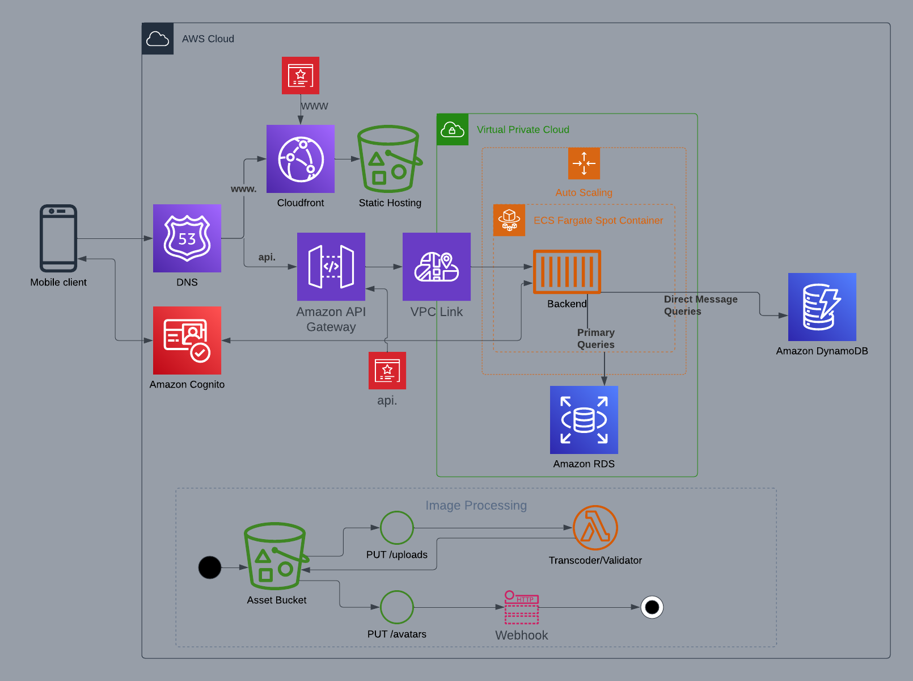

# Week 10 — CloudFormation Part 1

## Homework

Implement CFN Networking Layer: [Done](https://github.com/lightweavr/aws-bootcamp-cruddur-2023/blob/main/aws/cfn/networking.yml)

Implement CFN Networking Layer (Diagram): Done

Implement CFN Cluster Layer: [Done](https://github.com/lightweavr/aws-bootcamp-cruddur-2023/blob/main/aws/cfn/service.yml)

Implement CFN Toml: Skipped

Implement CFN Service Layer for Backend: [Done](https://github.com/lightweavr/aws-bootcamp-cruddur-2023/blob/main/aws/cfn/backend.yml)

Implement CFN Database Layer (RDS): [Done](https://github.com/lightweavr/aws-bootcamp-cruddur-2023/blob/main/aws/cfn/db.yml)

Implement Service and Database (Diagram): Done

Implement DynamoDB using SAM: [Done](https://github.com/lightweavr/aws-bootcamp-cruddur-2023/blob/main/aws/sam/ddb.yml)

Implement DynamoDB (Diagram): Skipped

Implement CI/CD: [Done](https://github.com/lightweavr/aws-bootcamp-cruddur-2023/blob/main/aws/cfn/cicd.yml) (and [Codebuild nested stack](https://github.com/lightweavr/aws-bootcamp-cruddur-2023/blob/main/aws/cfn/codebuild.yml))

Implement CI/CD (Diagram): Skipped

Implement CFN Static Website Hosting for Frontend: [Done](https://github.com/lightweavr/aws-bootcamp-cruddur-2023/blob/main/aws/cfn/frontend.yml)

## cfn-toml

I skipped this because I wrote a [combined script](https://github.com/lightweavr/aws-bootcamp-cruddur-2023/blob/main/bin/cfn) that handled all CFN deploys, plus setting parameter defaults on the cloudformation templates themselves.

Where needed, I specified the parameter once for CloudFormation to store and use it for future stack updates.

## Improvements

I used some intrinsic functions instead of hardcoding networking values:

* [`!GetAZs`](https://docs.aws.amazon.com/AWSCloudFormation/latest/UserGuide/intrinsic-function-reference-getavailabilityzones.html) - Return a list of AZs in the region
* [`!Cidr`](https://docs.aws.amazon.com/AWSCloudFormation/latest/UserGuide/intrinsic-function-reference-cidr.html) - Generate a list of CIDR blocks, and then use `!Select` to pick a CIDR for an AZ

I reduced the hardcoded networking details to a single VpcCidrBlock instead of the CidrList + parameters for each AZ.

Unfortunately, [Mappings couldn't be exported](https://docs.aws.amazon.com/AWSCloudFormation/latest/UserGuide/mappings-section-structure.html);  otherwise, I'd have exported a map of AZ: Security groups.

I also changed the database template:

* Using [`{{resolve}}` with SSM](https://docs.aws.amazon.com/AWSCloudFormation/latest/UserGuide/dynamic-references.html#dynamic-references-ssm-secure-strings) to set the Master password
* Exporting the database user & endpoint as SSM variables instead of changing the hard-coded `CONNECTION_URL` string in SSM
* Used gp3 for the database storage

I added:

* Eventbridge rule to build the front end automatically on a schedule
* Lifecycle rules on the static site bucket to expire old builds (mainly the CSS/JS with cache-busting) instead of relying on the syncer
* Retention settings on created LogGroups so logs aren't kept around indefinitely
* Custom script to build & deploy CloudFormation and SAM stacks

## Extension: API Gateway instead of ALB

My main difference is using API Gateway + Cloud Map to handle backend requests instead of an ALB + target group.

The API Gateway was straightforward to set up once I stopped using SAM and used standard CloudFormation. I was able to set up the following:

* Domain Certificate
* Route 53 Alias records
* Custom domain mapping
* Pre-signed URL generator Lambda
* JWT Authorizer on the pre-signed URL generator
* Default route & stage sends all unmatched traffic to the ECS Cluster

The biggest problem was ECS only supports Service Connect or Service Discovery with a Private Hosted DNS. The [documentation does specify this](https://docs.aws.amazon.com/apigateway/latest/developerguide/http-api-develop-integrations-private.html#http-api-develop-integrations-private-Cloud-Map), but it was unclear if Service Discovery over HTTP worked since the DNS mention was "use SRV records", which SD over HTTP might have set.

Initially, I used Service Discovery over HTTP since it was closer to what I needed, but ECS or Cloud Map failed to set the port number (`AWS_INSTANCE_PORT`) in the instance registration. API Gateway failed requests with `No target endpoints found for integration`.

ECS's Service Connect worked when setting it manually. But the ARN of the resulting Cloud Map service wasn't exposed, so I couldn't use CloudFormation to set up the link because I had no way of telling API Gateway which integration to use.

I tried different combinations to get something working but was unsuccessful and had to use the Private Hosted DNS service discovery option. That worked at the cost of paying for another Route 53 hosted zone.

## Cloudformation notes

* Had to add a list of custom YAML tags to settings.json to stop VSCode complaining: <https://github.com/threadheap/serverless-ide-vscode/issues/93#issuecomment-661626359>
* Changing a parameter default does nothing after a stack is created; you have to pass the parameter in the command invocation explicitly
* Leaving API Gateway v2 defaults unset could result in problems during deletion since the order is unspecified
* If I need to change an exported value, update the dependent stack with the hardcoded value, update the exported value, then change the dependent stack back to referencing the new value
