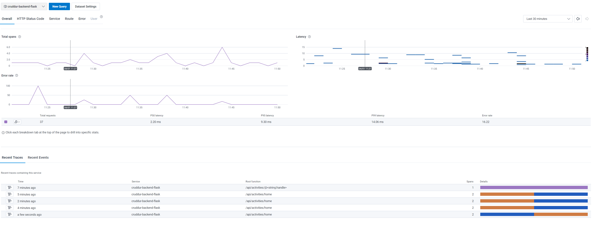
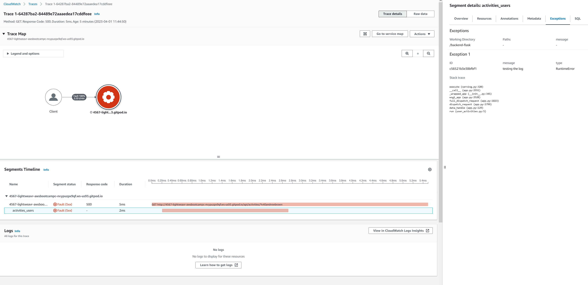
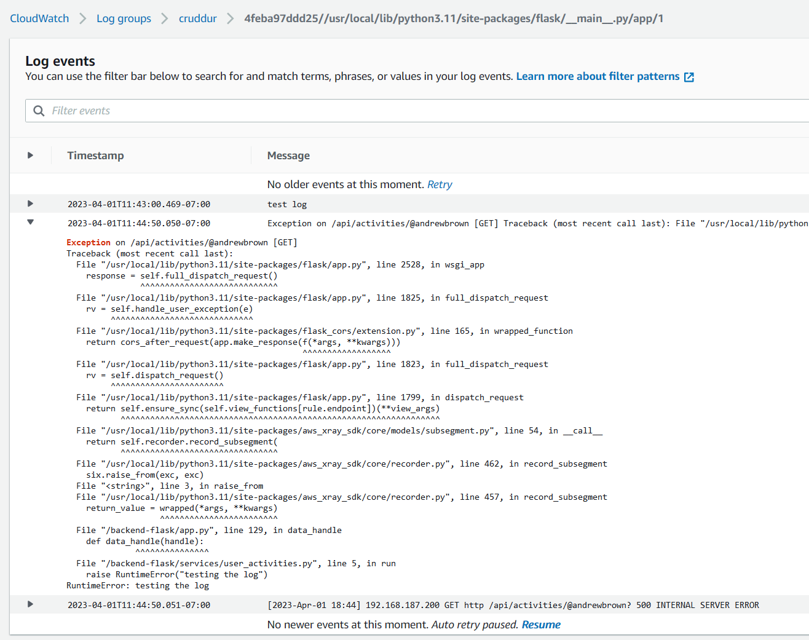
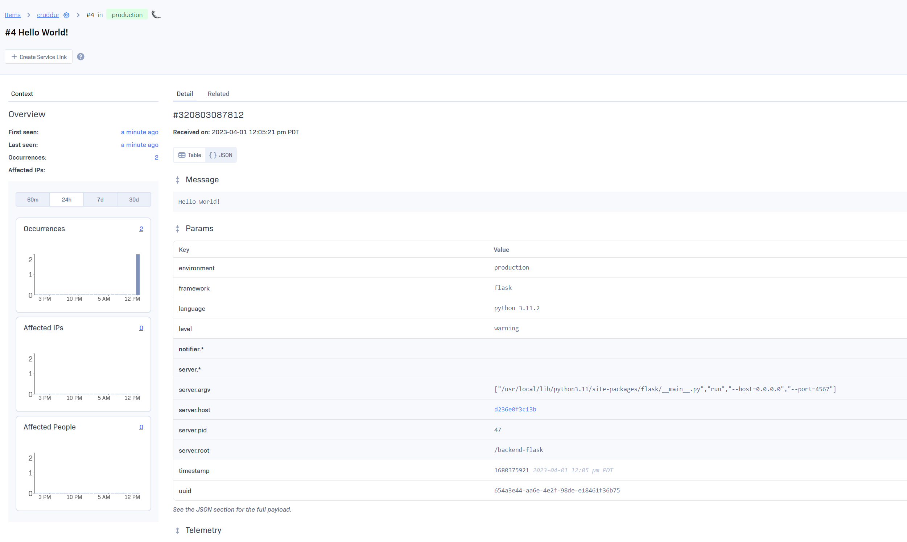
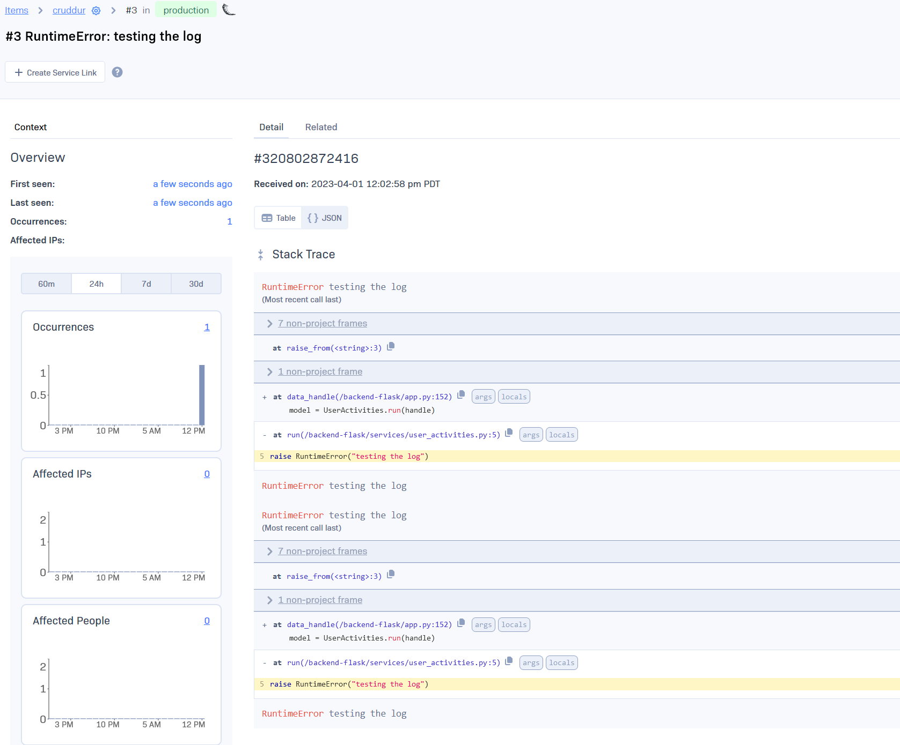

# Week 2 — Distributed Tracing

Had to rebuild the docker container - tried deleting image with `docker rmi` to force a rebuild, but it complained the image was in use - which I guess it was, even after `docker compose down`? `docker compose rebuild` seemed to fix it without restarting the workspace.

Also added some code to force a 500 Internal Server Error to be returned on the profile endpoint, commiting it with the code commented out.

## Instrument Honeycomb with OTEL

Honeycomb was straight forward. Copied & pasted the given lines, worked on the first try.

## Instrument AWS X-Ray (and subsegments)

X-Ray was more difficult, particularly around sampling. The given X-Ray sampling JSON file didn't work because of ServiceName issues. I attempted to filter out the health checks by setting the sampling weight to 0 when the Host is set to 127.0.0.1, but it wasn't successful.

I changed the URL path to match `/api/activities/home` to see if that would prove sampling was actually working, but I continued to see traces from the healthcheck. I tried following [the docs on sampling](https://docs.aws.amazon.com/xray/latest/devguide/xray-console-sampling.html#xray-console-custom), but given there's interplay between the AWS Console, X-Ray daemon, AND X-Ray SDK, I'm not sure the sampling rules are getting propagated properly.

If the sampling becomes an issue, I'll change it to use the local sampling rules.

I'm not sure the "log on custom subsection not being closed" is working properly - the [logging section](https://docs.aws.amazon.com/xray/latest/devguide/xray-sdk-python-configuration.html#xray-sdk-python-configuration-logging) specifically calls out "unclosed subsegments", but when I intentionally break the code by commenting out the `end_subsegment` call, there's no debug output.

The naming is also weird, it's using the defined service name (`backend-flask`) for the health checks, but the Host Header for browser driven queries. I'm not sure why, I expected the dynamic naming (`XRAY_URL`) to kick in for all requests.

## Configure custom logger to send to CloudWatch Logs

No issues here. Customized the stream name so it doesn't include the process ID in the stream so I don't fill up the Cloudwatch Logs pane with multiple log streams. I followed [the watchtower docs](https://kislyuk.github.io/watchtower/#watchtower.CloudWatchLogHandler) to do this.

I changed the provided functionality to only send logs when the response isn't `200 OK`. Discovered that if Flask is in debug mode, the `after_request` handler doesn't get invoked, so I restarted the container with the env var `FLASK_DEBUG` set to `0`, and triggered an error. The stack trace got sent to Cloudwatch logs as expected.

I also changed the retention through the Cloudwatch UI to only store 1 day of logs. I don't think I'm going to cross the free tier limit of 5GB, but I might forget to clean it up, and the default retention is indefinite.

## Rollbar

Also no issues. Had to change the issue filtering to include the `WARNING` state so I could see the Hello World test in the Rollbar UI.

## Notes

I bet part of the problem in the live stream with generating the xray traces was the default sampling rule of 1/s and 5% of other requests: <https://docs.aws.amazon.com/xray/latest/devguide/xray-sdk-python-configuration.html#xray-sdk-python-configuration-sampling>

<https://docs.aws.amazon.com/xray/latest/devguide/xray-concepts.html> is a nice overview of the xray service

Annotations vs Metadata in X-Ray: essentially, annotations can be filtered on in queries, metadata can't; metadata can store more datatypes (though I'm not sure why you'd want to store than numbers & strings in observability...)
