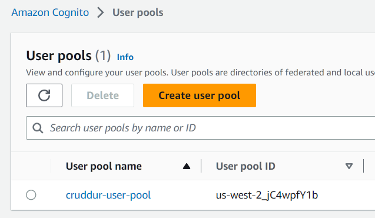

# Week 3 — Decentralized Authentication

## Setup Cognito User Pool

Done, had to recreate it once because of the `preferred_name` issue.



## Implement Custom Signin/Signup/Confirmation/Recovery Page

Done, also updated the other pages (in the frontend) to [pass the `Authentication` header to the backend](https://github.com/lightweavr/aws-bootcamp-cruddur-2023/commit/04502c397e671222f20e284ea376b42410dd6deb). No more `Cookie` use.

## Verify JWT token server side

Done, also added the verification to the activities/user page (but not elsewhere).

## Watch about different approaches to verifying JWTs

Andrew calls out <https://github.com/awslabs/aws-support-tools/blob/master/Cognito/decode-verify-jwt/decode-verify-jwt.py> as being simpler than the file we ended up using, and it's the basis for our file - [line 89 of the file we pulled in](https://github.com/cgauge/Flask-AWSCognito/blob/master/flask_awscognito/services/token_service.py#L89) links to the AWS Labs file.

## Extensions

I found [a way to refresh expiring tokens in Cognito](https://docs.amplify.aws/lib/auth/manageusers/q/platform/js/#retrieve-current-session), and updated the authorization JS code to refresh the access token stored in local storage. (Unconditionally right now, in the future if/when I figure out how to isolate it in it's own reusable block I'll extend it to check if the token differs and update it.)

As part of that I reordered the execution order in Javascript to update the auth first before fetching data, so the token presented to Flask should never be expired.

I used `black` to [consistently format the Python code](https://github.com/lightweavr/aws-bootcamp-cruddur-2023/commit/b99e9d0bd4e5f1a8fdfe4d2435158fbc7626c94e), and `prettier` to [do the same for the Javascript code](https://github.com/lightweavr/aws-bootcamp-cruddur-2023/commit/6ecedb09f870054b22ea4aa7b8c7cafa2683debf). I added the two commits to [`.git-blame-ignore-revs`](https://docs.github.com/en/repositories/working-with-files/using-files/viewing-a-file#ignore-commits-in-the-blame-view) so they don't appear in the Github blame UI.

I also resolved some eslint/webpack lints: [1](https://github.com/lightweavr/aws-bootcamp-cruddur-2023/commit/8cd089f33b270514f9f53914d666484bde0193e8) [2](https://github.com/lightweavr/aws-bootcamp-cruddur-2023/commit/07da5d9ea6a718fed63212e04ea8873806cd38c3) [3](https://github.com/lightweavr/aws-bootcamp-cruddur-2023/commit/9a28b9fda1fa0db7a042889b2fe47136a0cda728)

Now the frontend compiles without complaints:

```plain
Compiling...
Compiled successfully!
webpack compiled successfully
```

I also added [user id to the xray tracing in the activities/user page](https://github.com/lightweavr/aws-bootcamp-cruddur-2023/commit/2374ada99b92d44358f31152421a348cbea8b102) following <https://docs.aws.amazon.com/xray/latest/devguide/xray-sdk-python-segment.html#xray-sdk-python-segment-userid>.

## Notes

eslint references:

* Dump the internal `eslint` rules:`npx eslint --print-config eslint.conf.json > .eslintrc.json` (for some reason even giving a path, eslint prints the rules to stdout)

* Setting up prettier and eslint: <https://www.rockyourcode.com/format-and-fix-all-files-with-prettier-and-es-lint-recursively/>

* Had to add `env: node` so eslint stopped complaining about `process` being undefined: <https://itecnote.com/tecnote/javascript-eslint-process-is-not-defined/>

* Webpack complained about `start` vs `flex-start`, <https://github.com/mozilla/addons-frontend/issues/7312> discusses it but it seems to be because we use `display: flex` but then say `align-items: start` instead of `flex-start`... the discussion seems to be saying we should align items with the start of the `flex` block instead of... something else?

Might want to take the Flask-AWSCognito middleware and implement it so I can use a decorator within Flask instead of copy-pasting the `access_token` handling: <https://github.com/cgauge/Flask-AWSCognito/blob/master/flask_awscognito/plugin.py>
