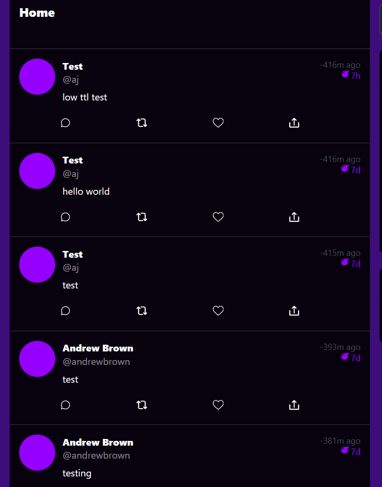

# Week 4 — Postgres and RDS

## Create RDS Postgres Instance

Done.


## Create Schema for Postgres

[Done](https://github.com/lightweavr/aws-bootcamp-cruddur-2023/blob/main/backend-flask/db/schema.sql).

## Bash scripting for common database actions

[Done](https://github.com/lightweavr/aws-bootcamp-cruddur-2023/blob/main/backend-flask/bin/db).

Extension: Combined all the commands into a single script that uses `case` statements to select which function to perform.

## Install Postgres driver in backend application

Done, surprisingly no issues.

## Connect Gitpod to RDS instance

[Done](https://github.com/lightweavr/aws-bootcamp-cruddur-2023/blob/main/backend-flask/bin/update-sg-rule).

Extension: Added env var checks, moved the IP fetch into the script, and added a timestamp in the description field so I know when the update was run.

## Create AWS Cognito trigger to insert user into database

[Done](https://github.com/lightweavr/aws-bootcamp-cruddur-2023/blob/main/backend-flask/lambdas/cruddur-post-confirmation.py).


Problem: Didn't realise it had to return the original event, first attempt just returned `{}` and the confirmation screen had an error about expecting a version number. Found a [solution on Stack Overflow](https://stackoverflow.com/a/67067112).

## Create new activities with a database insert

[Done]()



Problem: Created activities were using the hardcoded `andrewbrown` handle.
Extension/Solution: Changed the activity creation code to take the Cognito user id and fetch the user uuid from the database.

## Notes

Resources used for the bash scripting:

* Linting: <https://www.shellcheck.net/>
* `BASH_SOURCE` variable: <http://mywiki.wooledge.org/BashFAQ/028>

I changed some of database stuff, mainly to avoid indirection:

* Instead of loading scripts at runtime from a directory, I changed the templates to just be strings in a separate Python file.
* Removed the `COALESCE` from the provided query scripts since we're checking for empty results and returning the relevant empty struct manually
* Used the named parameters for [SQL injection risk](https://www.psycopg.org/psycopg3/docs/basic/params.html#danger-sql-injection), then they were introduced in the last video

### For later development/changes to the database

[dict_rows in psycopg](https://www.psycopg.org/psycopg3/docs/advanced/rows.html#row-factories) seems to mimic the conversion to JSON - provides the row headers in a mapping.

These two are roughly equivalent in my testing.

```python
from psycopg.rows import dict_row

# sql="(SELECT COALESCE(row_to_json(object_row),'{}'::json) FROM (select * from activities) object_row);"
sql="select * from activities;"
with pool.connection() as conn:
    with conn.cursor(row_factory=dict_row) as cur:
        cur.execute(sql)
        res = cur.fetchall()
```

If I do drop the json coercion in Postgres, timestamps and uuids aren't serializable into json by default. There are solutions:

* <https://stackoverflow.com/a/22238613>
* <https://github.com/django/django/blob/main/django/core/serializers/json.py>
* <https://www.psycopg.org/psycopg3/docs/advanced/adapt.html#adapt-example-inf-date>

Warning: psycopg3 is a newer version/rewrite of psycopg2, based on <https://www.psycopg.org/articles/2021/08/30/psycopg-30-beta1-released/>. We're using psycopg2 in the lambda layer, and psycopg3 in Docker, probably because there's a prebuilt layer for psycopg2 in Lambda. The two libraries _can be different_.
