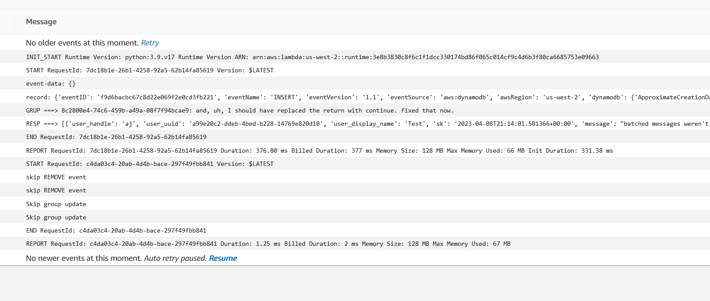

# Week 5 — DynamoDB and Serverless Caching

## Data Modelling a Direct Messaging System using Single Table Design

Single Table Design in DynamoDB is mindbending because the _context_ an attribute is used in matters.

In one context, `user_uuid` could refer to the _other_ party's uuid, while in another context it's _your own_ uuid.

I can't think of it like "this column is X" because it changes.

## Implementing DynamoDB query using Single Table Design

Done.

## Provisioning DynamoDB tables with Provisioned Capacity

Done with the included schema.

## Utilizing a Global Secondary Index (GSI) with DynamoDB

Done with the included schema.

## Rapid data modelling and implementation of DynamoDB with DynamoDB Local

Installed NoSQL Workbench locally and used [an SSH proxy](https://www.baeldung.com/linux/ssh-tunneling-and-proxying) to connect to the Gitpod workspace.

Port forwarded the NoSQL Workbench port with `ssh -L 8001:127.0.0.1:8000 '<username>@<gitpod-container>.gitpod.io'`

## Writing utility scripts to easily setup and teardown and debug DynamoDB data

Also done. Like the DB scripts, combined them into [a single file](https://github.com/lightweavr/aws-bootcamp-cruddur-2023/blob/main/backend-flask/bin/ddb).

## Notes

### DynamoDB

There is a distinction in the DDB sdk between resource vs client. Resource is the higher level thing that might be easier to use within ddb.py, but the lower level client is needed in the initialization steps.

If I want to implement pagination, will need to look at [`LastEvaluatedKey`](https://docs.aws.amazon.com/amazondynamodb/latest/developerguide/Scan.html#Scan.Pagination).

I had two distinct message groups with the same person because I ended up running the seed script twice, with the conversation load failing the first time. I tried to implement an access pattern with a Local Secondary Index of `pk` and `user_uuid`, but the LSI seemed to double the storage cost.

The LSI ended up being large because it's not [a sparse index](https://docs.aws.amazon.com/amazondynamodb/latest/developerguide/bp-indexes-general-sparse-indexes.html). Messages were setting `user_uuid`, which made the LSI pull every message into the LSI.

I'm not sure how it ended up with IndexSizeBytes=TableSizeBytes considering that the message _content_ doesn't appear to be in the LSI (I set the `Projection` attribute to just `message_group_uuid`), but potentially because it was a _Local_ index so it was the size of the original table?

I ended up dropping the LSI in favour of doing a query + filter expression. It's not as resilient without pagination support, but it'll work for now. And the old index definition, just for good measure:

```python
LocalSecondaryIndexes=[
    {
        "IndexName": "pk-user-uuid-index",
        "KeySchema": [
            {"AttributeName": "pk", "KeyType": "HASH"},
            {"AttributeName": "user_uuid", "KeyType": "RANGE"},
        ],
        "Projection": {"ProjectionType": "INCLUDE", "NonKeyAttributes": ["message_group_uuid"]},
    }
]
```

Also, we didn't consider the job of clearing out old messages when people delete their accounts. Ended up with duplicate info after running the seed script with two different user uuids -- since I had to recreate my user to trigger the db sync in the lambda.

### Lambda

Made a few changes:

* Set the Cloudwatch log retention to 1 day
* Changed Retries to 1 (the trigger was continuously retrying)
* Used [`batch_writer`](https://boto3.amazonaws.com/v1/documentation/api/latest/reference/services/dynamodb/table/batch_writer.html) to group the remove/creates
  * From 180ms to 47ms - DDB seems to be ~40ms round trip
* Enabled batching within the trigger to reduce the number of invocations (and billing), main usecase is probably going to be skipping over the 4 change notifications
  * Each run was _just_ over 1ms, so I got billed for 2ms, the new batch runs are ~1.5ms. But it's gone from 4 invocations of 2ms each to a single invocation of 2 ms, a clear win



```plain
Before batch_writer:
Duration: 510.89 ms Billed Duration: 511 ms Memory Size: 128 MB Max Memory Used: 66 MB Init Duration: 339.97 ms
After:
Duration: 353.06 ms Billed Duration: 354 ms Memory Size: 128 MB Max Memory Used: 66 MB Init Duration: 306.05 ms
```

### UI weirdness

I stopped the hard refresh happening when sending messages in existing groups - changed `MessageForm.js` to be `if (data.message_group_uuid && !data.created_at)`

So many potential improvements if it was actually production:

* Unnecessary duplication in the create_message.py because of the create vs update mode that really just hinges on "does it have a group uuid yet"?
* UI is janky:
  * Should clear the textbox on submit
  * Scroll on submit to the most recent message
  * Send target is based on the URL, but the list of messages doesn't update when that changes
    * I can't switch between message panes? And if I'm on the other pane, it'll send a message to the other person.
* messages use a subset of what is returned: handle, display_name, message, created_at

This isn't great, but also... kind of out of the remit of the _AWS_ side of things. I don't anticipate needing to learn react, so I'm not putting time in to fix it.
