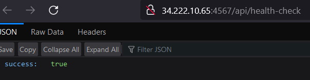
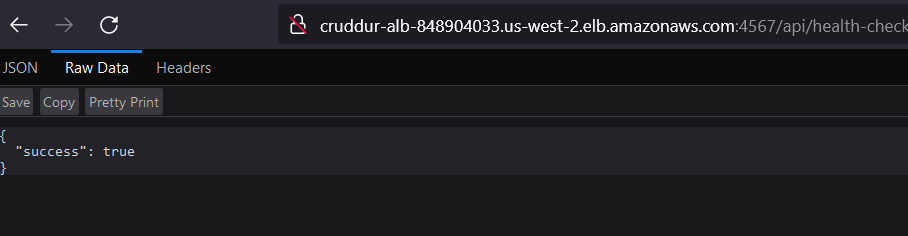
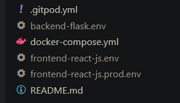

# Week 6/7 — Deploying Containers & Solving CORS with a Load Balancer and Custom Domain

This week I diverged from the expected state a lot to try and reduce the spending on AWS services that don't scale to 0.

Finished all the homework, then tore a bunch down and rebuilt it differently.

## Homework

Deploy an ECS Cluster using ECS Service Connect - Done

Deploy serverless containers using Fargate for the Backend and Frontend Application - Done



Route traffic to the frontend and backend on different subdomains using Application Load Balancer - Done



Securing our flask container - Done

Creating several bash utility scripts to easily work with serverless containers - Done


Extensions:

* Used ECR Pull Through cache to pull from ECR instead of Docker Hub
* Removed the access key & secret from enviroment variables
* Used Fargate Spot capacity provider instead of Fargate
* Used API Gateway instead of ALB in front of the backend
* Used Cloudfront + S3 instead of the frontend container

## ECR Pull Through cache

The Docker official verified images are [replicated to ECR Public](https://www.docker.com/blog/news-from-aws-reinvent-docker-official-images-on-amazon-ecr-public/). There's no benefit to replicating the specific Docker images ourselves, we could use the Public ECR endpoints instead of Docker Hub.

In the spirit of "Docker Hub/Public repos are a point of failure", I set up a [Pull-Through cache](https://aws.amazon.com/blogs/aws/announcing-pull-through-cache-repositories-for-amazon-elastic-container-registry/) for ECR, so I have a private repo for the public Docker images I use.

## Backend on ECS Fargate

Setup the role & policy following the guide. I needed to add [an additional policy to the Executor role - `AmazonECSTaskExecutionRolePolicy`](https://docs.aws.amazon.com/AmazonECS/latest/developerguide/task_execution_IAM_role.html) for it to fetch the ECR images.

I dropped the Access Key and Secret from the environment variables, relying instead on the provided container credentials. AWS officially supports this: [1](https://docs.aws.amazon.com/sdkref/latest/guide/feature-container-credentials.html) [2](https://docs.aws.amazon.com/AmazonECS/latest/developerguide/task-iam-roles.html)

The container keys worked, but I needed to attach another policy for DynamoDB access.

It looks like we're being secure since we had to add specific permissions to the ECS Task role, but that ignores the fact that our Access Key/Secrets are only being used by the Flask backend, and not other things in the Task.

For connecting with [ECS Exec](https://docs.aws.amazon.com/AmazonECS/latest/userguide/ecs-exec.html), I figured out a command that fetches the task ARN and passes it to the `execute-command` invocation to I don't need to look up the task ID and copy & paste it:

```bash
aws ecs execute-command --region us-west-2 --cluster cruddur --task $(aws ecs list-tasks --cluster cruddur --service-name backend-flask |jq .taskArns[0] --raw-output) --container backend-flask --command "/bin/sh" --interactive
```

For whatever reason, without `--raw-output` the CLI was complaining about an invalid ARN, I suspect there were some formatting escapes being applied. I got the hint from this StackOverflow answer](https://stackoverflow.com/a/74296214).

I'm using the AWS Console to connect to the containers instead of running the session manager within Gitpod. Saves me from installing it in the Gitpod environment & keeps me in the AWS Console.

The steps of tagging a local image, pushing it, and then performing a forced update on the ECS service got annoying and I scripted it.

## Frontend on Fargate + ALB

Setting up the ALB + container infrastructure to run nginx to serve a few MB of static files is silly. Static files should be cloudfront+S3 or on another CDN.

But I set it up for the experience - [Docker multi-stage builds](https://docs.docker.com/build/building/multi-stage/) are pretty cool, and I got to do the full setup of the ALB, including adjusting the rules to [support multiple domains on a single ALB](https://pfisterer.dev/posts/multiple-domains-aws-lb/).

I ended up simplifying the production Dockerfile a bit more - the `ENV` statements weren't useful since nginx just serves the compiled JS. Removing them and leaving just the [`ARG` statements](https://docs.docker.com/engine/reference/builder/#arg) meant there were fewer layers in the final container, which is less to push to ECR.

Annoyingly, you can't specify an `ARG` file like you can with an `ENV` file, so the build command was decently long:

```bash
docker build \
--build-arg REACT_APP_BACKEND_URL="https://api.cpbc.lightweaver.ca" \
--build-arg REACT_APP_AWS_PROJECT_REGION="$AWS_DEFAULT_REGION" \
--build-arg REACT_APP_AWS_COGNITO_REGION="$AWS_DEFAULT_REGION" \
--build-arg REACT_APP_AWS_USER_POOLS_ID="us-west-2_jC4wpfY1b" \
--build-arg REACT_APP_CLIENT_ID="4mq8n71ja47g2t9cd616t3p136" \
-t frontend-react-js \
-f frontend-react-js/Dockerfile.prod \
frontend-react-js/
```

No issues setting up the Target Groups. I noticed that the port argument in the groups seems to be ignored - the ALB used the ports exposed by the container directly instead of the port specified in the Target Group (there was some concern on what ports the ALB would listen on & forward traffic to).

## Notes

* Image tab in Public ECR copies the Docker URI if you click a button - no need to construct it by hand
* `docker image prune` to garbage collect the unused images - <https://docs.docker.com/config/pruning/>
* `docker create` creates a container from an image, but doesn't start it. Useful to preemptively download the image layers

---

## Shrinking Spend From $1.60/day to $0.14/day (Technical Blog Post)

This post was motivated by my surprise at the running bill the day after starting the ALB and the 2 Fargate containers. Unfortunately, my AWS account is out of the free tier, so I no longer have the free ALB or the free RDS instance. I did get a $25 credit from the Fargate team through the bootcamp, but the new bill showed I was chewing through the credit faster than I'd like.

I estimated that I was spending about $1.60/day from a combination of sources:

* RDS is $0.46/day, $0.016 x 24 hours = $0.384/day for the instance, plus storage at $0.115/GB-month x 20 GB / 30 days/month = $0.077/day
* The ALB is about $0.54/day based on $0.0225 x 24 hours (not accounting for usage charges)
* The smallest possible ECS task costs $0.296/day ($0.04048/vCPU/hour x .25 vCPU + $0.004445/GB/hour x 0.5GB), and I need two, for $0.592/day

The daily spend of ~$1.60 meant the credit would run out in 15 days. Thankfully I got into the habit of checking the billing dashboard. Since the billing alarms don't consider the credit, I've been checking the billing dashboard after setting up new AWS stuff to ensure no surprises.

I decided to focus on 3 directions:

1. Find out if there were cheaper variants I could use (e.g., move from small to micro instance)
2. Use alternative services that scale to 0
3. When all else fails, turn stuff off

### Fargate Spot

Looking at the [published Fargate prices](https://aws.amazon.com/fargate/pricing/#Pricing_Details), there's a ~20% price reduction if I use ARM containers instead of x86. I didn't recall seeing the option when setting up the Fargate containers, but it looks like [a change to the task definition is enough](https://docs.aws.amazon.com/AmazonECS/latest/userguide/ecs-arm64.html).

But the more significant price win is using Fargate Spot, which is [30% of the standard price](https://aws.amazon.com/fargate/pricing/#Fargate_Spot_Pricing_for_Amazon_ECS) (as I write this, $0.012144/vCPU/hour & $0.0013335/GB/hour, which are precisely 30% of the regular price or $0.088/day). Unfortunately, Fargate Spot only supports Linux/x86, so there's no additional discount for using ARM.

### Actually using Fargate Spot was convoluted

I thought adding Fargate Spot was going to be easy since [it's been released since 2019](https://aws.amazon.com/blogs/aws/aws-fargate-spot-now-generally-available/), [but the AWS docs had me dropping into the CLI](https://repost.aws/knowledge-center/ecs-fargate-spot-capacity-provider):
> Adding Fargate Spot capacity provider to an existing cluster is not supported using the AWS Management Console.

I'd say I'm surprised, but I'm not - AWS is legendary for "ship the MVP."

Thankfully the documentation did provide a command to "Associate Fargate Spot capacity provider." I had to customize it to default to Fargate Spot capacity, which required reading about [service definition parameters](https://docs.aws.amazon.com/AmazonECS/latest/developerguide/service_definition_parameters.html), among other things.

```bash
aws ecs put-cluster-capacity-providers   --cluster cruddur --capacity-providers FARGATE FARGATE_SPOT --default-capacity-provider-strategy capacityProvider=FARGATE_SPOT,weight=1 --region us-west-2
```

I also had to set the `capacityProviderStrategy` to `"capacityProvider": "FARGATE_SPOT"` [in the service definition](https://github.com/lightweavr/aws-bootcamp-cruddur-2023/blob/main/aws/json/service-backend-flask.json#L3-L9) to actually use Fargate Spot, even after setting the default capacity provider for the cluster it didn't switch.

The switch took about an hour and shaved $0.41/day off the charges, extending the credit to 21 days. I wonder why AWS didn't make it easy - using EC2 Spot Instances is much cleaner.

## Integrating Flask Fargate Container with API Gateway

I moved on to the next direction: looking for alternative services. I had switched to a cheaper container solution but was already on the cheapest RDS instance, and ALB doesn't have a lower tier. The ALB provided routing for the Flask app; I looked at API Gateway or Cloudfront to replace the ALB routing functionality.

I discovered that the latest HTTP-only API Gateway supports sending traffic to the ECS target groups through [Cloud Map/Service Connect](https://aws.amazon.com/blogs/architecture/field-notes-integrating-http-apis-with-aws-cloud-map-and-amazon-ecs-services/) - which is something the bootcamp had us set up, so API Gateway natively worked here.

With the API Gateway created, I created a route for `/api/health-check`, set the Integration to the EC2 Target Group, and tried it in my browser - and I got back a successful health check.

I then experimented a bit more to see if I could avoid creating routes for every method on the Flask backend and ultimately ended up with a single route - `ANY /{proxy+}`, which was pointed at the backend-flask target group. I didn't create any stages (kept the default one), set a custom domain name, and used Route 53 + Certificate Manager to make the API appear identical to when it was running behind the ALB.

### Confusingly named "VPC Link"

One problem I had was the [API Gateway pricing page](https://aws.amazon.com/api-gateway/pricing/) didn't answer how much AWS charges for the VPC Link that [Service Connect/Cloud Map integrations require](https://docs.aws.amazon.com/apigateway/latest/developerguide/http-api-develop-integrations-private.html#http-api-develop-integrations-private-Cloud-Map). [The VPC PrivateLink pricing page](https://aws.amazon.com/privatelink/pricing/) suggested $0.01/hour, but [a Stack Overflow question](https://stackoverflow.com/questions/66351283/aws-api-gateway-vpc-link-pricing) says the VPC Link is free.

Ultimately, I created the VPC link since I needed to and decided to see how much I'd get charged the next day since, in the worst case, $0.24 was still less than the ALB's $0.54.

As for my VPC Link pricing question - it turned out that the VPC Link was free. The [docs say that VPC Link is "just" an Elastic Network Interface managed by API Gateway](https://docs.aws.amazon.com/apigateway/latest/developerguide/http-api-vpc-links.html), and AWS [doesn't charge for ENIs](https://repost.aws/questions/QUJovSyZBFShmFzZntCyk_1Q/price-per-eni).

## Serving static content with Cloudfront + S3

After my success with API Gateway + Cloud Map, I considered doing it for the second container (which was running nginx) but decided to try Cloudfront + S3 first.

### Why have a container to run nginx to serve static files?

Having a container just for serving static files is a weird choice. Using a container _during_ development was fantastic since the container isolated and _contained_ the development dependencies. However, having the files pre-compiled as part of a release and bundled with an nginx container doesn't need that isolation, so I don't see any benefit using a container.

Additionally, in the context of the bootcamp, I'm surprised it wasn't done with Cloudfront + S3 from the start _because this is another set of services to learn_ [in the giant pile of services](https://twitter.com/andrewbrown/status/1642875099777994752). Andrew (the bootcamp instructor) said he doesn't like Cloudfront because of the slow update times, but once you set it up, the update times aren't a factor. It's not necessarily _straightforward_ to get Cloudfront set up, but setting up the ALB wasn't simple either.

### Actually Setting up S3 + Cloudfront (+ ACM) + Route 53

This was more complex than the API Gateway, even though I created S3-backed Cloudfront distributions years ago. I ended up making a few mistakes, but what I did, roughly in order:

1. I started by creating an S3 bucket and copying the compiled React assets into the bucket
2. I created a CloudFront distribution and added the bucket as an origin. This is where all my mistakes were:
    * Cloudfront suggested that I use the [S3 website endpoint](https://docs.aws.amazon.com/AmazonS3/latest/userguide/WebsiteEndpoints.html) instead of the S3 bucket directly. As far as I can tell, doing so had no benefit and actually forced me to open the bucket to public reads.
    * I did not add my desired domain to the "Alternate domain name (CNAME)" list. This meant Cloudfront couldn't match the requested `Host` header to my CloudFront distribution when I requested the site, and annoyingly _didn't tell me this was a problem_.
    * I didn't set the Default root object to index.html; on the first page load, I got a 404 error.
    * All my certs were in us-west-2, so I had to pause and add an ACM cert in us-east-1. Thankfully Route 53 is global, so I didn't need to duplicate my hosted zone.
3. I created a Route 53 record for my domain and pointed it at the CloudFront distribution
    * If I had set up the CNAME for Cloudfront, the distribution would have shown up as an Alias target. I was wondering why the list of Cloudfront distributions was blank, and I eventually gave up and pasted the URL of the Cloudfront distribution. Retrying after I fixed the CNAME, the distribution was listed as a valid Route 53 target.

I spent about 30 minutes figuring out why Cloudfront gave me a 403 error. One document I found suggested that my [Origin Access Control didn't work](https://repost.aws/knowledge-center/s3-rest-api-cloudfront-error-403), and I deleted and recreated the CloudFront -> S3 Origin setup trying to get this to work, including stopping using the S3 website endpoint.

The biggest miss was CloudFront needed my Route 53 domain name set as a CNAME before it worked. I [missed the prerequisite in the Route 53 docs (#4)](https://docs.aws.amazon.com/Route53/latest/DeveloperGuide/routing-to-cloudfront-distribution.html#routing-to-cloudfront-distribution-prereqs), but found answers in [StackOverflow](https://stackoverflow.com/a/42845612), as well as [the AWS forum](https://repost.aws/questions/QU50ZuYzSbQgOe71-UrOg6QA/questions/QU50ZuYzSbQgOe71-UrOg6QA/route53-alias-to-cloudfront-distribution-not-listed).

One non-standard thing I did was add a CloudFront rule to not cache `index.html` since everything but `index.html` is either versioned by the React builder or is a static file like the images provided by the bootcamp. I discovered this when I rebuilt the React app and copied it to the S3 bucket, and the changes I expected weren't showing up; Cloudfront was still serving the older content. I had to run an [Invalidation](https://docs.aws.amazon.com/AmazonCloudFront/latest/DeveloperGuide/Invalidation.html) to get the changed `index.html` to be picked up.

But I got Cloudfront working, meaning I could drop both the ALB charge and the second Fargate container - saving me $0.84/day.

## Scale to zero

The third and final thing I did was figuring out commands to start and stop the database and ECS service from the CLI. By stopping it when I'm done working, I don't get charged overnight or when I'm not actively working on it. Unfortunately I can't get rid of the charge for 20GB of RDS space, but this is the only ongoing charge at this point. I could snapshot the instance and restore from the snapshot, but that only saves 2 cents/GB-Month. I'd have to manage snapshots and much slower start/stop cycles.

I also have to credit Andrew for a handy spending tip - He pointed out that you could set an ECS Service to 0 replicas as a money-saving tactic. This is much faster to resume than my original plan, which was deleting and recreating the service when needed.

## 20x or 2.9x savings?

I went from $1.60/day to $0.08/day when I'm not working on it, a 20x cost reduction.

If I turn the backend container and RDS instance back on for development work and leave it for 24 hours, the price goes up to $0.55/day, "just" a 2.9x cost reduction.

I achieved the goal of extending how long the credit will last - 45 days, or almost exactly to the end of the bootcamp.
