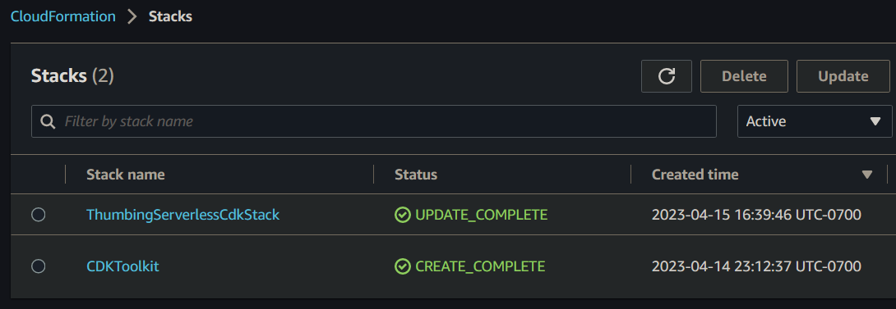
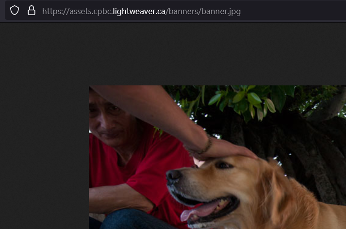
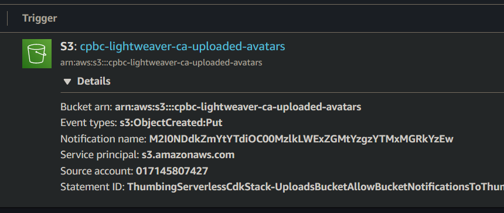

# Week 8 — Serverless Image Processing

## Homework

Create CDK stack

Done.



Create s3 bucket to store assets

Done.

```json
$ aws s3api list-buckets
{
    "Buckets": [
        {
            "Name": "assets-cpbc-lightweaver-ca",
            "CreationDate": "2023-04-23T00:14:22+00:00"
        },
```

Serve assets behind Cloudfront

Done



Process images using a javascript lambda running sharpjs

Done

Implement lambda layers

Done

```json
$ aws lambda list-layers
{
    "Layers": [
        {
            "LayerName": "jwt",
            "LayerArn": "arn:aws:lambda:us-west-2:017145807427:layer:jwt",
            "LatestMatchingVersion": {
                "LayerVersionArn": "arn:aws:lambda:us-west-2:017145807427:layer:jwt:1",
                "Version": 1,
                "Description": "Lambda Layer for JWT",
                "CreatedDate": "2023-04-22T22:35:36.268+0000",
                "CompatibleRuntimes": [
                    "ruby2.7"
                ],
                "LicenseInfo": "MIT"
            }
        }
    ]
}
```

Use s3 event notifications to trigger processing images

Done



Implement HTTP API Gateway using a lambda authorizer

Done

```json
$ aws apigatewayv2 get-authorizers --api-id gsl8vxlw40
{
    "Items": [
        {
            "AuthorizerId": "nifghd",
            "AuthorizerPayloadFormatVersion": "2.0",
            "AuthorizerResultTtlInSeconds": 300,
            "AuthorizerType": "REQUEST",
            "AuthorizerUri": "arn:aws:apigateway:us-west-2:lambda:path/2015-03-31/functions/arn:aws:lambda:us-west-2:017145807427:function:cruddur-jwt-authorizer/invocations",
            "EnableSimpleResponses": true,
            "IdentitySource": [
                "$request.header.Authorization"
            ],
            "Name": "jwt-authorizer"
        }
    ]
}
```

Implement a ruby function to generate a presigned URL

Done [GitHub](https://github.com/lightweavr/aws-bootcamp-cruddur-2023/blob/main/aws/lambdas/cruddur-avatar-presigned-s3-url/function.rb)

Upload assets to a bucket client side using a presigned URL

Done [GitHub](https://github.com/lightweavr/aws-bootcamp-cruddur-2023/blob/main/frontend-react-js/src/components/ProfileForm.js#L54-L60)

## Extensions

* bin/avatar - combined avatar management commands into a single script
* Resizer Lambda now [deletes the source image](https://github.com/lightweavr/aws-bootcamp-cruddur-2023/blob/main/aws/lambdas/process-images/index.js#L28) instead of relying on lifecycle configuration
  * Including [updating IAM definition in CDK to grant the Lambda the `DeleteObject` permission](https://github.com/lightweavr/aws-bootcamp-cruddur-2023/blob/main/thumbing-serverless-cdk/lib/thumbing-serverless-cdk-stack.ts#L109)
* [Bash script to upload the lambda authorizer](https://github.com/lightweavr/aws-bootcamp-cruddur-2023/blob/main/bin/lambda-upload-authorizer)
* Changed profile link to [link to the currently logged in user](https://github.com/lightweavr/aws-bootcamp-cruddur-2023/blob/main/frontend-react-js/src/components/DesktopNavigation.js#L34)
* DDB Stream (Week 5) improvement: Used [DynamoDB Stream Filtering](https://docs.aws.amazon.com/amazondynamodb/latest/developerguide/Streams.Lambda.Tutorial2.html) to reduce the number of times the DDB message update lambda is invoked (saving invocation costs)
  * Filter used: `{"eventName": [{"anything-but": ["REMOVE"]}],"dynamodb": { "Keys": { "pk": { "S": [{"prefix": "MSG#"}] } } } }`

## Notes

* Why we need `REACT_APP_` env var prefix: <https://create-react-app.dev/docs/adding-custom-environment-variables/>
* Check if `ecr login` ran by making sure `/home/gitpod/.docker/config.json` exists
* Need to script the delete incomplete multipart uploads setting, add it to the CDK? For the future, [CDK S3 Lifecycle API docs](https://docs.aws.amazon.com/cdk/api/v2/docs/aws-cdk-lib.aws_s3.LifecycleRule.html)
* CORS settings in the API Gateway don't seem to be respected? No headers _at all_ on the returned response, seems to be stripped from the response
* Attached the JWT authorizer to OPTIONS routes, but the preflight request doesn't send Authorization so it always failed (unsure if the JWT authorizer was enabled in the video)

## Potential followups

* Default Cloudfront S3 cache setup caches objects for 24 hours by default, avatar uploads aren't reflected immediately. Disabled caching for now. Considered invalidations, but those are charged + slow.
* Edit button is shown on all profiles, not just mine (and the profile icon in the sidebar is selected regardless of which profile is active)
