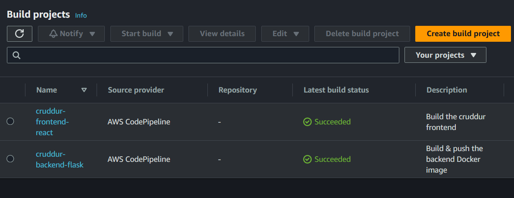
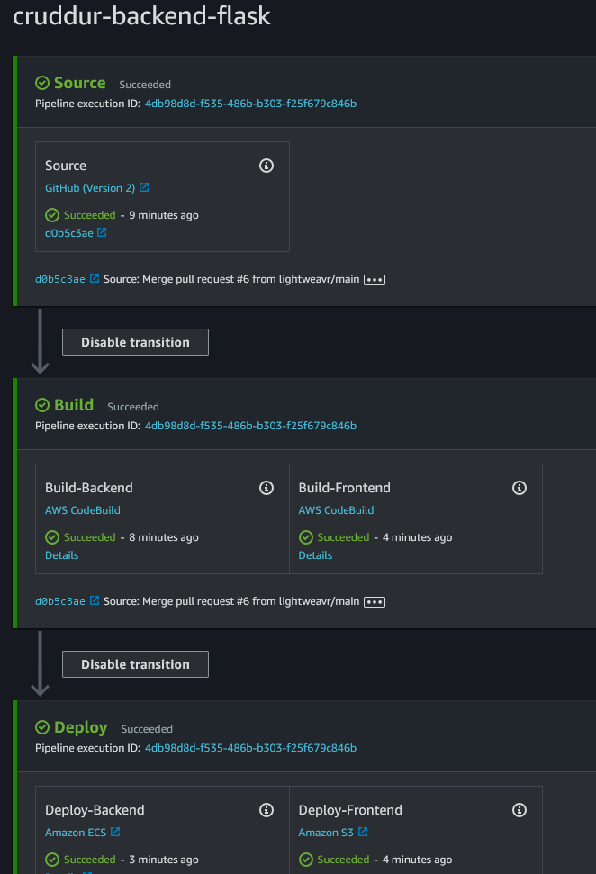

# Week 9 — CI/CD with CodePipeline, CodeBuild and CodeDeploy

## Homework

Configure CodeBuild Project

Done

Configure CodePipeline

Done

Create a buildspec.yml file

Done ([Github](https://github.com/lightweavr/aws-bootcamp-cruddur-2023/blob/main/backend-flask/buildspec.yml))

I removed the account ID and `AWS_DEFAULT_REGION` env vars from the provided `buildspec.yml` file. `ACCOUNT_ID` was unused, and `AWS_DEFAULT_REGION` is provided by [the default codebuild envvars](https://docs.aws.amazon.com/codebuild/latest/userguide/build-env-ref-env-vars.html).

## Permissions

First run didn't have permissions to fetch the auth token from ECR, second run had `not authorized to perform: ecr:BatchGetImage`

Got an initial list of permissions from the [Amazon ECR sample for CodeBuild](https://docs.aws.amazon.com/codebuild/latest/userguide/sample-ecr.html), ultimately copied permissions from [`EC2InstanceProfileForImageBuilderECRContainerBuilds`](https://docs.aws.amazon.com/aws-managed-policy/latest/reference/EC2InstanceProfileForImageBuilderECRContainerBuilds.html) to include the permissions for an image _push_ to ECR.

One misstep of adding the `AWSCodeDeployRoleForECSLimited` AWS managed policy to CodeBuild role - CodeBuild doesn't need the _deployment_ permissions. The generated `AWSCodePipelineServiceRole` already has permissions to do an ECS deployment (It's got a somewhat worryingly long list of Full access permissions, actually). Ended up removing the policy from the role.

## Deployment Failures from uncleaned infra

Third and fourth runs had the build succeeded, but deploy failed with `Invalid action configuration`. Ultimately this was because I'm not using an ALB to front the domain anymore, but I left the target group defined in the ECS Service spec.

1. Target Group does not have an associated Load Balancer - I tried deleting the target group

2. The target group `arn:aws:elasticloadbalancing:us-west-2:017145807427:targetgroup/cruddur-backend-flask-tg/65a4b22d04a2da32` does not exist

Had to remove the load balancer entry in the backend service definition with `aws ecs update-service --cluster cruddur --service backend-flask --load-balancers []` - couldn't do it through the UI though.

## Extension - build & deploy the frontend to S3

Created an additional action in the build & deploy stages so there's just one trigger for both frontend+backend deploys (and staying in the [AWS Pipeline Free Tier](https://aws.amazon.com/codepipeline/pricing/) - 1 active pipeline/month)

Found a node 18 runtime in the [Runtime Versions list](https://docs.aws.amazon.com/codebuild/latest/userguide/runtime-versions.html), though I had to use the Ubuntu image instead of Amazon Linux 2 because the node 18 runtime is only available on the `Ubuntu standard:7.0` image according to the [Available Runtimes List](https://docs.aws.amazon.com/codebuild/latest/userguide/available-runtimes.html).

Enabled caching the `node_modules` folder to the frontend build following the [buildspec specification reference](https://docs.aws.amazon.com/codebuild/latest/userguide/build-spec-ref.html).

My first run had a problem: The "Unzipped" file just left the build.zip file in the S3 bucket.

I found [a StackOverflow question](https://stackoverflow.com/questions/54484028/aws-codebuild-buildspec-yml-get-all-files-and-subfolders-recursively) which didn't mention manually zipping files. I suspected CodeBuild is zipping all the files up, so adding the explicit zip means everything is just doubly zipped, and confirmed it by downloading the built artifact and verifying it was a zip within a zip.

I ended up changing the buildspec artifact file selection to select all the files from the `build/` directory, the resulting build was deployed successfully.

One ongoing problem is the deployment is a one-way copy, so the older CSS/JS files are still lying around because they have a hash in their name. I'm not too sure how I want to clean them up, for now I can just delete them but eventually I'd want an automated solution like Lambda checking ~daily and deleting all but the most recent file.
